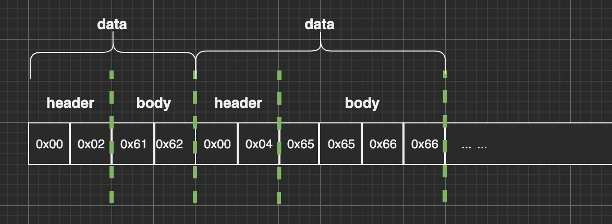

## 安装

```shell
npm i @lvgithub/stick
```

## 背景

由于 TCP 协议是面向流的协议，我们使用 TCP 通信的时候，需要解析出我们的数据，就需要对流进行解析。也就是所谓的拆包，把流解析为一段段我们所需要的数据。本方案为 Node.Js 实现的一个粘包处理方案。[喜欢的话 star，想订阅点 watch~](https://github.com/lvgithub/stick)

## 原理

对要发送的数据进行协议编码，把一份数据`data`分为 `header` +`body`两个结构，header 默认固定长度（_2 byte_），`header`的内容描述的是 `body` 数据的长度。由于`header`定长，因此可以通过解析`header`，动态解析 `body` 的内容。

默认 `header` 我们使用 `2 Byte` 的存储空间，即`Int16`最大表示的 `body` 长度为 `32767`,也就是`16M`。



如上图，我们看先取出数据流的前两位，读取到内容 `0x00, 0x02`转化为整数的长度是 2，再读取出`body`第3、4位 `0x61, 0x62`。下面是一个简单的demo：

```javascript
// example/tcpSample.js
'use strict';
const net = require('net');
const { Stick, MaxBodyLen } = require('../index');
const stick = new Stick(1024);

// 设置最大传输body大小为 32K，即 header用两个 Byte,最大表示的值为 32767
stick.setMaxBodyLen(MaxBodyLen['32K']);

// server端
const server = net.createServer(socket => {
  
    // socket 接收到的 片段 put 到 stick 中处理
    socket.on('data', data => {
        stick.putData(data);
    });
  
    // stick 会解析好一个个数据包，按照接收的顺序输出
    stick.onBody(body => {
        console.log('body:', body.toString());
    });

    server.close();
});
server.listen(8080);

// client 端
const client = net.createConnection({ port: 8080, host: 'localhost' }, () => {
  
    // 客户端通过 stick 打包内容
    const data = stick.makeData(JSON.stringify({ userName: 'liuwei' }));
  
    // 然后把打包对的内容通过 TCP 发送给 服务端
    client.write(data);
  
    client.destroy();
});
```

Output:

```shell
$ node example/sample.js
body: {"userName":"liuwei"}
```

## More Example

* [*sample.js*](./example/sample.js)
* [*tcpSample.js*](./example/tcpSample.js)
* [*typescript-sample.js*](./example/typescript/tsSample.ts)

## API

- ## Class: Stick

    - **new Stick(bufferSize: number)**

         Stick 类用于处理数据包，从流中解析出用户定义的一块快数据

        * **bufferSize** Stick处理数据包初始化的缓存大小，默认 512 Bytes

        

    - **putData(buf: Buffer)**

        往 stick 中put 收到的数据流

        

    - **onData(callback)**

        当收到的数据流中包含了完整的数据块，触发回调返回数据块（`header`+`body`）

        * **callback**: (buf: Buffer): void

        

    - **onBody(callback)**

        当收到的数据流中包含了完整的数据块，触发回调返回数据内容（`body`）

        

    - **makeData(body: string): Buffer**

        用于客户端中，帮助生成符合 Stick 协议的数据块（`data`）

        

    - **setMaxBodyLen(length: MaxBodyLen)**

        设置`body` 的最大长度，提供两种配置见 ** MaxBodyLen**

* #### **Enum: MaxBodyLen**

    * **32K**  最大32kb
    * **2048M** 最大 2048M 

## License

[MIT](http://opensource.org/licenses/MIT)